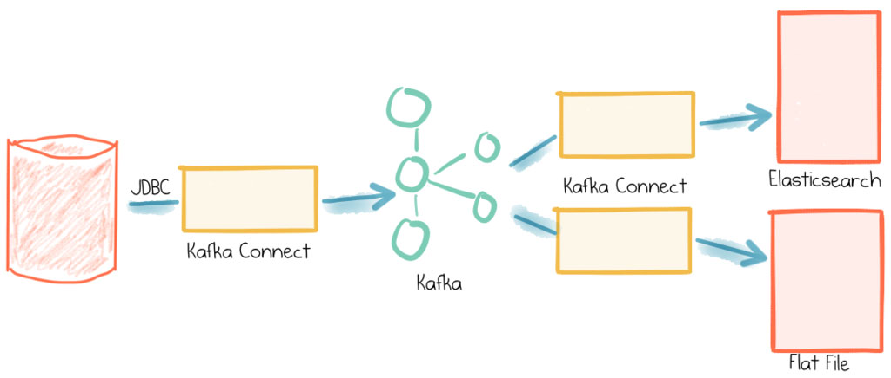

# Objective
> Objective: Sync data from Mysql -> Kafka -> Couchbase and ElasticSearch

 Mysql is a data source when one event changes in Mysql will push a message into Kafka queue

 The message then eventually write to Couchbase or ES

General flow<br>


<br>
Multiple sources and multiple sinks


<br>

# Step by step to setup Mysql -> Kafka  -> Couchbase

## Download Kafka
Download a binary version 2.7 from https://kafka.apache.org/downloads

## Configure kafka data dir for easier control kafka data
- Edit `config/server.properties`. Change `log.dirs=/path/to/your/data/kafka` 
- Edit `config/zookeeper.properties`. Change `dataDir=/path/to/your/data`


## Install Debezium as a Kafka plugin
- Download debezium-connector-mysql from `https://repo1.maven.org/maven2/io/debezium/debezium-connector-mysql/0.9.2.Final/debezium-connector-mysql-0.9.2.Final-plugin.tar.gz`.
- Create `./plugins` dir and extract to it.<br>
- The final dir is `./plugins/debezium-connector-mysql/*.jar`

## Configure connector
Edit `connector-distributed.properties`. Uncomment and change `plugin.path=./plugins` where plugins contains *.jar

# Start Mysql with Mysql Docker
- Configure Mysql with replica binlog in master.cnf<br>
```
server-id         = 223344
log_bin           = /var/log/mysql/mysql-bin
binlog_format     = row
binlog_row_image  = full
expire_logs_days  = 10
```
- Mysql user priviledge
```
GRANT SELECT, RELOAD, SHOW DATABASES, REPLICATION SLAVE, REPLICATION CLIENT ON *. * TO 'debezium' IDENTIFIED BY 'dbz';
```

- If your Mysql is being running, a replica user type is needed, for now use root
- Your running mysql will not impact by these setup
# Start kafka services: Zookeeper, Broker, Connector
Now eveything is properly configured, lets start the services
- Start zookeeper:
`
bin/zookeeper-server-start.sh config/zookeeper.properties 
`
- Start broker:
`
bin/kafka-server-start.sh config/server.properties
`
- Start connector:
`
connect-distributed.sh config/connect-distributed.properties
`

## Check services
Now the neccessary services are started
- Zookeeper
- Broker
- Kafka connect
- Mysql


## Register Kafka Connect with Mysql server
```
curl -k -X POST -H "Accept:application/json" -H "Content-Type:application/json" http://localhost:8083/connectors/ -d '{
"name":"mysql-connector-demo-classicmodels",
"config":{
    "connector.class":"io.debezium.connector.mysql.MySqlConnector",
    "database.hostname":"localhost",
    "database.port":"3306",
    "database.user":"root",
    "database.password":"root",
    "database.server.id":"2",
    "database.server.name":"MySQL-CM",
    "database.history.kafka.bootstrap.servers":"localhost:9092",
    "database.history.kafka.topic":"mysql.history.cm",
    "key.converter":"org.apache.kafka.connect.json.JsonConverter",
    "key.converter.schemas.enable":"false",
    "value.converter": "org.apache.kafka.connect.json.JsonConverter",
    "value.converter.schemas.enable":"false"
}
}'
```
**For particular DB, Table**
```
"table.whitelist":"db-name.table-name",
"database.whitelist": "inventory",
or 
"database.include.list": "inventory",
```


## Check status
```
curl -k http://localhost:8083/connectors/mysql-connector-demo-classicmodels/status
```
---

# Test
Write some data into Mysql and check the kafka topics

---
<br><br>
# NEXT 
<br><br>
# Couchbase sink
Above configuration is for Kafka connect source where Mysql is a data source when one event changes in Mysql will push a message into Kafka queue

Now we are going to setup Kafka sink for Couchbase to get data from queue and put into Couchbase
## Download plugin Couchbase source
https://packages.couchbase.com/clients/kafka/4.0.2/couchbase-kafka-connect-couchbase-4.0.2.zip

## Copy `lib/*.jar` files to Kafka `plugins` dir

- Copy from `lib/*jar` to `./plugins/kafka-connector-couchbase`
- Final dir: `./plugins/kafka-connector-couchbase/*.jar`

## Restart Kafka Connector
```
connect-distributed.sh config/connect-distributed.properties
```
## Register Couchbase Sink
```
curl --location --request POST 'http://localhost:8083/connectors/' \
--header 'Accept: application/json' \
--header 'Content-Type: application/json' \
--data-raw '{
"name": "CB-sink-1",
"config": {
    "connector.class": "com.couchbase.connect.kafka.CouchbaseSinkConnector",
    "topics": "MySQL-Database.table_name",
    "couchbase.seed.nodes": "127.0.0.1",
    "couchbase.bucket": "blog",
    "couchbase.username": "xxx",
    "couchbase.password": "xxx",
    "key.converter": "org.apache.kafka.connect.storage.StringConverter",
    "value.converter": "org.apache.kafka.connect.json.JsonConverter",
    "value.converter.schemas.enable": "false"
}
}'
```
## Check status
```
curl -k http://localhost:8083/connectors/CB-sink-1/status
```
If everything is running, you will see data will flow from `Kafka` to `Couchbase`

# Test entire flow

Write data from Mysql and that entry will appear in Couchbase

`Mysql` -> **`Kafka`** -> `Coucbase`

---


<br><br>
# NEXT
<br><br>

# ElasticSearch Sink Connect
Now sync data to ElasticSearch


## Download kafka-connect-elasticsearch lib
https://d1i4a15mxbxib1.cloudfront.net/api/plugins/confluentinc/kafka-connect-elasticsearch/versions/11.0.0/confluentinc-kafka-connect-elasticsearch-11.0.0.zip

## Copy files in `lib/*.jar` to `plugins`

The final structure `./plugins/kafka-connect-elasticsearch/*.jar`

## Start kafka connect
```
connect-distributed.sh config/connect-distributed.properties
```
## Register ElasticSearch Sink
```
curl --location --request POST 'http://localhost:8083/connectors/' \
--header 'Accept: application/json' \
--header 'Content-Type: application/json' \
--data-raw '{
"name": "elasticsearch-sink-1",
"config": {
    "connector.class": "io.confluent.connect.elasticsearch.ElasticsearchSinkConnector",
    "tasks.max": "1",
    "topics": "MySQL-DB.classicmodels.offices",
    "connection.url": "http://localhost:9200",
    "type.name": "_doc",

    "key.converter"  : "org.apache.kafka.connect.storage.StringConverter",
    "value.converter": "org.apache.kafka.connect.json.JsonConverter",
    "value.converter.schemas.enable": "false",
    "schema.ignore": "false",
    "key.ignore": "true",
    "behavior.on.null.values": "delete"
}
}'
```

## Test
Records change in Mysql will write a message to ES


## Kibana
Create index pattern: http://localhost:5601/app/management/kibana/indexPatterns/create


